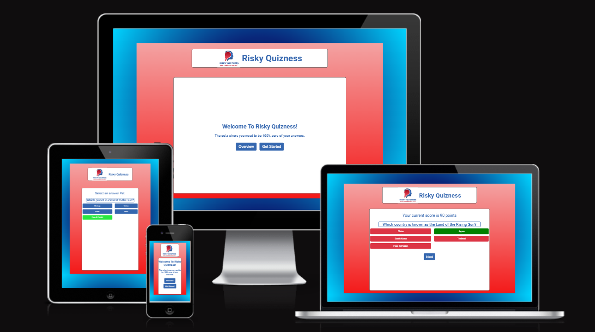

# Risky Quizness

This website is a fun and quick quiz page with a bit of a twist! 

## **[Live site](https://pat-forde.github.io/Quiz-Project2/)**

## **[Repository](https://github.com/Pat-Forde/Quiz-Project2)**

## UX 

### Pre Project

From the available choices I decided to build a quiz for this project. I wanted to do make it a bit more interesting than a standard quiz and had an idea to make the scoring of the quiz have an element of risk and strategy involved. 

### User Stories

### User
+ As a user I want to be engaged with an interesting quiz.
+ As a user I want to have fun with a challenging concept.
+ As a user I want the opportunity to improve my score.

### Site Owner
+ As the site owner I want to be able to provide an engaging site that will attract visitors.
+ As the site owner I want to stand out from the usual quiz formats.  
+ As the site owner I want to keep the users attention by enticing them to repeat the quiz and try to better their score.
+ As the site owner I want to create a personal connection to the 

### Design

From the outset I wished to provide a quiz game that would have an element of strategy or risk. I settled on the concept of penalising wrong answers whilst offering the user the chance to play it safe on a question they did not know the answer to.  
I wanted to present the site on one page with no links using Javascript to manipulate the display for ease of usage and simplicity for the player.

The entire quiz is hosted within one page. There are three divs of which only one will display at any time. There is a welcome / landing page div, a user signup div and a quiz div. Within the quiz div itself Javascript is further used to display or not display elements such as questions and results. 

**Process Notes**

**Testing**

Testing was carried out along the build with a mid way cut off point / test undertaken for the core 3 divs, testing at each stage of the quiz build and a full test procedure carried out upon completion.  

## Deployment

To deploy the project I followed the steps below starting from the [main project repository](https://github.com/Pat-Forde/Quiz-Project2).

 1. Clicked on `Settings` on the navigation menu in the repository
 2. I then selected the `Pages` menu on the side bar.
 3. In the first dropdown menu labeled `Source` I selected the branch of the name `main` from the dropdown.
 4. In the next dropdown labeled `/root` I left as the default option.
 5. Selected Save
 
  The project was then deployed.
  

**Credits**
Modal for rules overview learned from w3 schools.   
Quiz format based from an approach taught by Robert Jones **[Robert Johns Tutorial](https://hackr.io/blog/how-to-build-a-javascript-quiz-app)**

