# Risky Quizness

This website is a fun and quick quiz page with a bit of a twist! 

## **[Live site](https://pat-forde.github.io/Quiz-Project2/)**

## **[Repository](https://github.com/Pat-Forde/Quiz-Project2)**

## UX 

### Pre Project

From the available choices I decided to build a quiz for this project. I wanted to do make it a bit more interesting than a standard quiz and had an idea to make the scoring of the quiz have an element of risk and strategy involved. 

### User Stories

### User
+ As a user I want to be engaged with an interesting quiz.
+ As a user I want to have fun with a challenging concept.
+ As a user I want the opportunity to improve my score.

### Site Owner
+ As the site owner I want to be able to provide an engaging site that will attract visitors.
+ As the site owner I want to stand out from the usual quiz formats.  
+ As the site owner I want to keep the users attention by enticing them to repeat the quiz and try to better their score.
+ As the site owner I want to create a personal connection to the 

### Design

From the outset I wished to provide a quiz game that would have an element of strategy or risk. I settled on the concept of penalising wrong answers whilst offering the user the chance to play it safe on a question they did not know the answer to.  
I wanted to present the site on one page with no links using Javascript to manipulate the display for ease of usage and simplicity for the player. 

### Wireframes

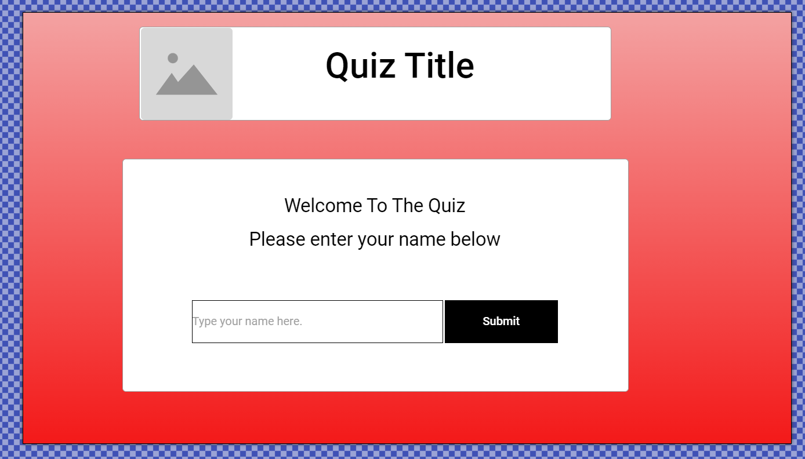
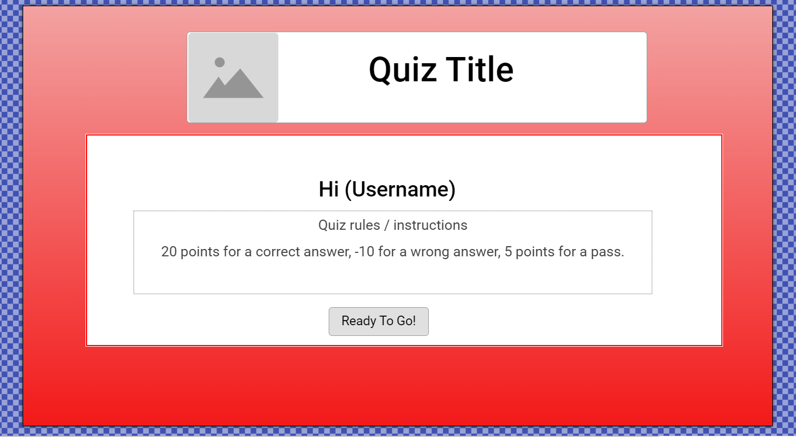
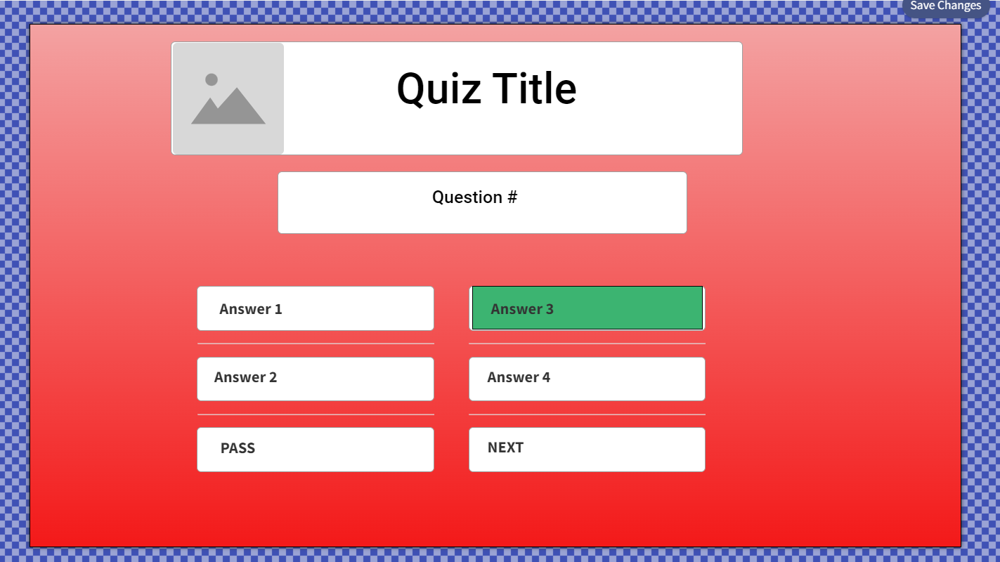

## User Flow
The entire quiz is hosted within one page. There are three divs of which only one will display at any time. There is a welcome / landing page div, a user signup div and a quiz div. Within the quiz div itself Javascript is further used to display or not display elements such as questions and results. 

**Welcome View**

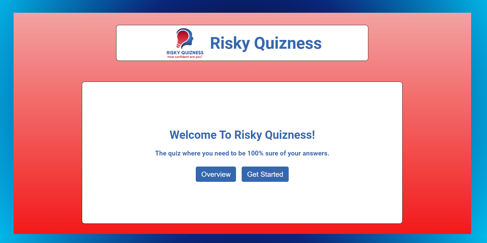  
The user is presented with a welcome screen from which they can choose to get an overview of the rules or to start a game.

**Overview**
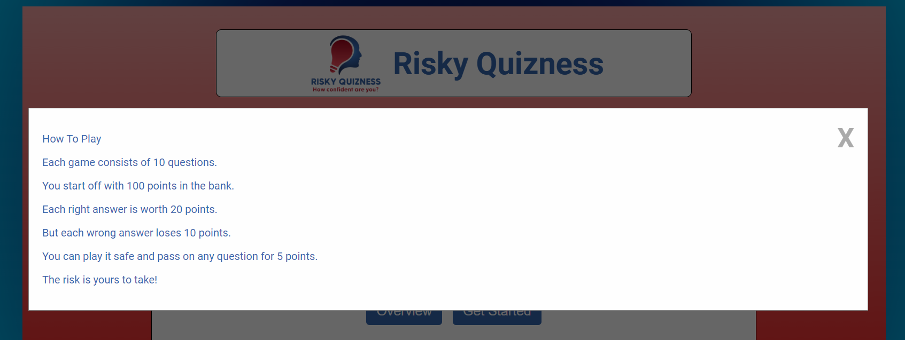
Overview displays as a modal over the page. 

**Username Entry**
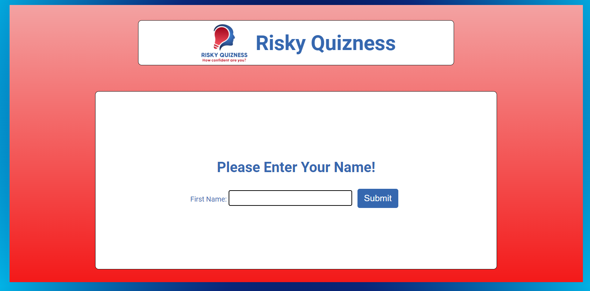  
The welcome div is hidden and replaced with a second div to capture the users name. This is stored for future reference.

**Good Luck Message**
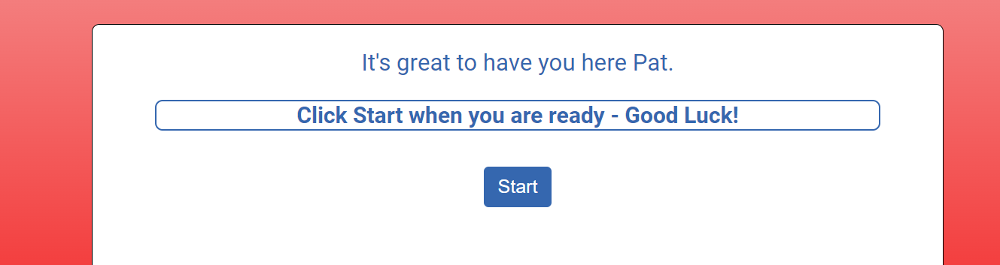  
The user name entry div is also hidden and replaced with a third div which contains the quiz structure. A good luck message is displayed and quiz starts when start is pressed.

**Questions**
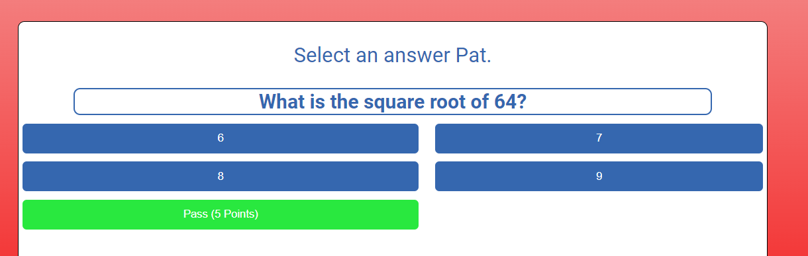  
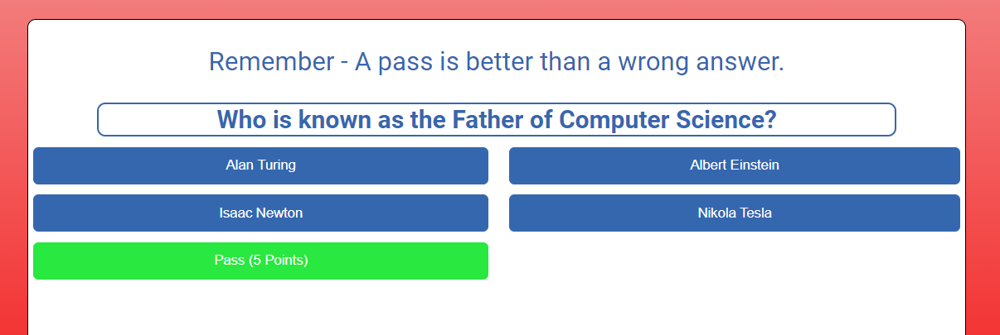  
Each question has 4 answers along with an option to pass if not sure of the answer. Pass option is highlighted in different colour to other options. The user welcome message is replaced with quiz related messages and current scoring.

**Answer Feedback**
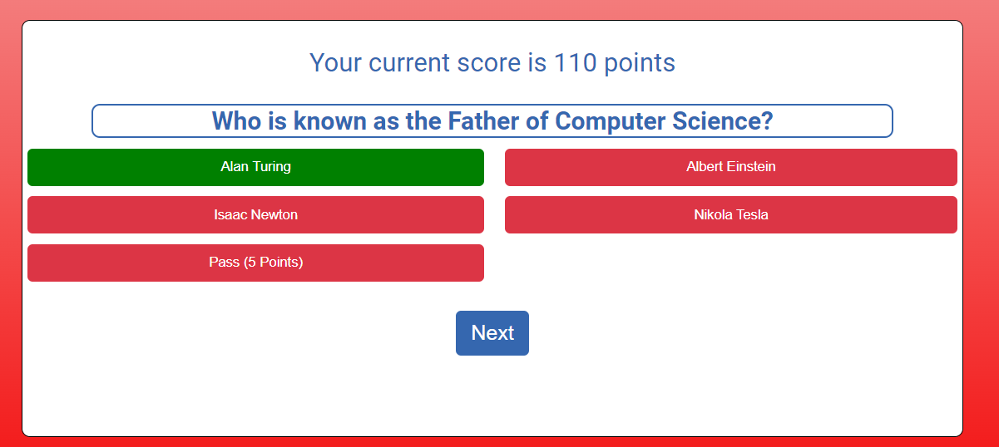 
After each answer the correct answer is highlighted.

**End Quiz**
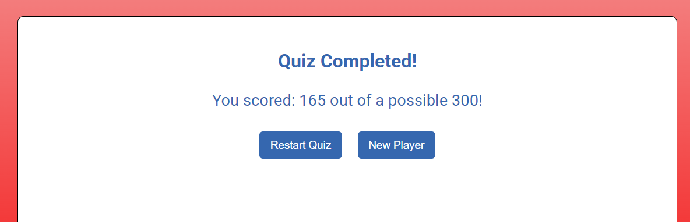  
Score is given along with options to restart with current player or go back to main page to register a new player.

## Testing ##

Testing was carried out along the build with a mid way cut off point / test undertaken for the core 3 divs, testing at each stage of the quiz build and a full test procedure carried out upon completion.  

 **Links and user inputs**
  | Test |Outcome  |
  |--|--|
  |Modal for overview of rules loads. | Pass  |
  |Modal closes when X clicked and also when clicked outside of modal.| Pass |
  |Get started button hides welcome div and displays signup div. | Pass |
  |Username input is stored and called without error during the quiz.| Pass |
  |Questions display correctly.| Pass |
  |Points scoring working accurately. |Pass|
  |Correct answers highlighted.|Pass|
  |Restart quiz function works correctly.|Pass|
  |Reset / New player function works correctly.|Pass|

  **Responsiveness**
  | Test |Outcome  |
  |--|--|
  |Display correctly on mobile device 320px wide| Pass |
  |Display correctly on tablet 768px wide| Pass |
  |Display correctly on laptop 1280px wide| Pass |
  |Display correctly on desktop 1600px wide| Pass |
  |Logo text removed on mobile devices | Pass |

### Validation Testing 

- HTML
No errors as per W3C Validator  
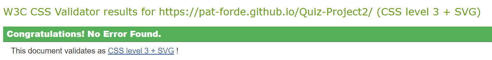
[W3C validator Home Page](https://validator.w3.org/nu/?doc=https%3A%2F%2Fpat-forde.github.io%2FQuiz-Project2%2F)   
  
- CSS
No errors as per W3C CSS Jigsaw Validator
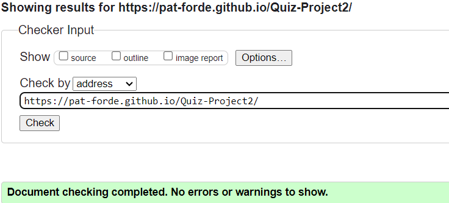  
[(Jigsaw) validator](https://jigsaw.w3.org/css-validator/validator?uri=https%3A%2F%2Fpat-forde.github.io%2FQuiz-Project2%2F&profile=css3svg&usermedium=all&warning=1&vextwarning=&lang=en)

### Lighthouse Testing

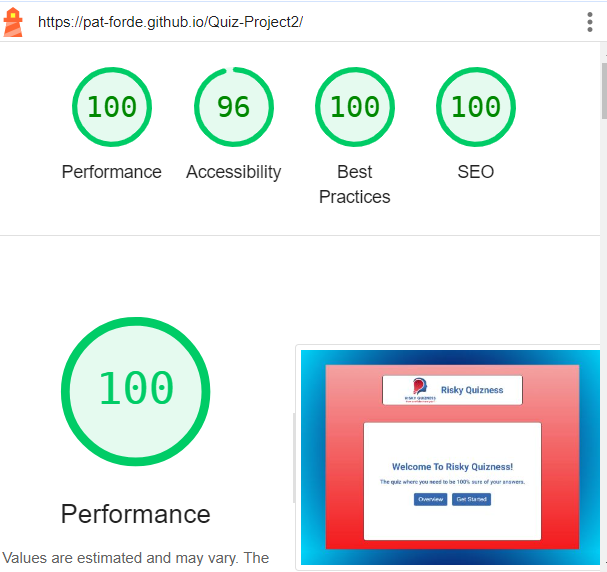  
Lighthouse testing returns high scores across all metrics.

### Deployment

To deploy the project I followed the steps below starting from the [main project repository](https://github.com/Pat-Forde/Quiz-Project2).

 1. Clicked on `Settings` on the navigation menu in the repository
 2. I then selected the `Pages` menu on the side bar.
 3. In the first dropdown menu labeled `Source` I selected the branch of the name `main` from the dropdown.
 4. In the next dropdown labeled `/root` I left as the default option.
 5. Selected Save
 
  The project was then deployed.
  

## Credits ##
+ Modal for rules overview learned from w3 schools.   
+ Quiz format based from an approach taught by Robert Jones **[Robert Johns Tutorial](https://hackr.io/blog/how-to-build-a-javascript-quiz-app)**
+ Quiz Logo designed at design.com.
+ Font supplied by Google Fonts
+ Further learning and support from Code Institute Slack Channels, Stackoverflow.com, Flexboxfroggy.com.  

## Thank You
  
A huge thank you to my Code Institute mentor Alan Bushell for his patience, guidance, support, encouragement and overall mentorship during this project.

